# Time-Series Forecasting Model Using LSTMs

This project trains an LSTM model to predict power outage duration, measured in
minutes, from the public Purdue Engineering **Major Power Outage Events in the
Continental U.S.** dataset. The workbook is kept locally as `Outage_Data.xlsx`;
the pipeline does not fabricate records or evaluation results.

## Workflow

```mermaid
flowchart LR
	A[Outage_Data.xlsx] --> B[Inspect dataset]
	B --> C[Clean target and missing values]
	C --> D[Create timestamp features]
	D --> E[Sort chronologically]
	E --> F[Scale using training data]
	F --> G[Create sequences]
	G --> H[Chronological train/test split]
	H --> I[LSTM model training]
	I --> J[Predict outage duration]
	J --> K[MAE, MSE, RMSE, R2]
	K --> L[Plots and exported results]
```



## Run

Install the dependencies and launch the Streamlit dashboard:

```bash
python -m pip install -r requirements.txt
streamlit run streamlit_app.py
```

## Deploy to Streamlit Community Cloud

1. Open [share.streamlit.io](https://share.streamlit.io) and sign in with GitHub.
2. Select this repository, the `main` branch, and `streamlit_app.py` as the main file.
3. Deploy the app. Streamlit Cloud uses Python 3.10.13 from `runtime.txt` and installs the packages from `requirements.txt`.

The committed workbook and latest result files allow the dashboard to open with
results immediately. Use the training button in the dashboard to generate a
fresh model run and refresh the charts.

The script looks for `outage data.xlsx` or `Outage_Data.xlsx` in the project directory. If neither file is available, it attempts to download the Purdue Engineering workbook from the configured `OUTAGE_DATA_URL`.

The current Purdue endpoint may return a server error. In that case, download the workbook from the Engineering research-data page and place it in this directory, or provide a working mirror:

```bash
OUTAGE_DATA_URL="https://example.org/Outage_Data.xlsx" python app.py
```

The dashboard can train the model and writes generated plots, metrics, and
predictions to the project directory.

## Latest Reproducible Run

These values come from running `python app.py` against the bundled workbook and
are also written to `model_metrics.txt`:

- Original dataset: 1,534 records and 57 variables
- Missing `OUTAGE.DURATION` values: 58
- Records after preprocessing: 1,398
- Features used: 47, including numeric variables and outage-start date features
- Sequence length: 30
- Chronological split: 1,094 training sequences and 274 test sequences (80/20)
- Architecture: two LSTM layers with 64 and 32 units, dropout 0.2, then Dense
	layers of 16 ReLU units and 1 linear output
- Optimizer/loss: Adam/MSE; batch size 32; early stopping with up to 100 epochs
- Missing numeric feature values were filled with the training-data median for
	`DEMAND.LOSS.MW`, `CUSTOMERS.AFFECTED`, `RES.PRICE`, `COM.PRICE`,
	`IND.PRICE`, `TOTAL.PRICE`, `RES.SALES`, `COM.SALES`, `IND.SALES`,
	`TOTAL.SALES`, `RES.PERCEN`, `COM.PERCEN`, `IND.PERCEN`, `POPDEN_UC`, and
	`POPDEN_RURAL`. Rows missing the target were removed; zero and negative
	durations were also excluded.

The latest test metrics are MAE `2632.4199` minutes, MSE `75230608.0000`
minutes squared, RMSE `8673.5576` minutes, and R² `-0.0203`. The model trained
for 19 epochs before early stopping. These metrics are
included as a record of the current run, not as fixed claims about future runs.

## Outputs

The Streamlit dashboard displays the source preview, preprocessing/model
configuration, all four metrics, training/validation loss, actual-versus-
predicted duration, and exported predictions. The generated charts area provides
five combined interactive charts summarizing the complete evaluation result.
Generated files include
`training_history.csv`, `model_metrics.txt`, and `predictions.csv`. The
dashboard renders the combined charts directly from these current data files.